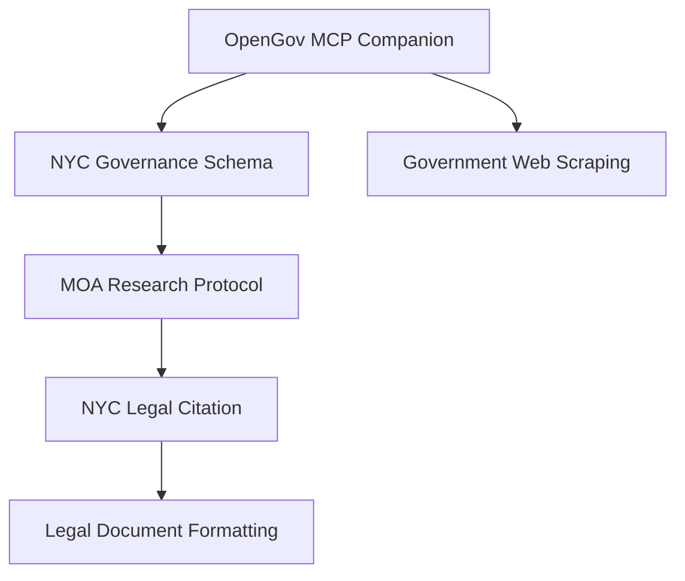

# NYC Governance Organizations - Configuration Guide

This directory contains project-specific MCP and security configurations for the NYC Governance Organizations Phase II implementation.

## Configuration Files

### MCP Configurations

#### `.cursor/mcp.json` (Main Configuration)
- **Purpose**: Primary MCP configuration for Claude Code integration
- **Usage**: Active configuration for normal development work
- **Features**:
  - NYC-specific OpenGov MCP server integration
  - Data Commons MCP for demographics and statistics
  - Playwright MCP for NYC.gov scraping
  - All project-specific skills loaded

#### `configs/mcp-development.json` (Development)
- **Purpose**: Development-oriented MCP configuration
- **Usage**: Copy to `.cursor/mcp.json` when debugging
- **Features**:
  - Visible browser mode for Playwright debugging
  - Enhanced logging and debugging output
  - Extended timeouts for development work
  - Slower delays for respectful testing

#### `configs/mcp-production.json` (Production)
- **Purpose**: Production-optimized MCP configuration
- **Usage**: Copy to `.cursor/mcp.json` for production data collection
- **Features**:
  - Headless browser mode for efficiency
  - Audit logging enabled
  - Caching enabled for performance
  - Optimized timeouts and delays

### Security Configuration

#### `configs/security-settings.json`
- **Purpose**: Comprehensive security policies and guidelines
- **Scope**: Data handling, web scraping ethics, API security, research integrity
- **Usage**: Reference document for all Phase II activities
- **Features**:
  - Data retention policies
  - Ethical scraping guidelines
  - API token security standards
  - Research integrity requirements

### Environment Configuration

#### `.env.template`
- **Purpose**: Template for environment variable configuration
- **Usage**: Copy to `.env` and customize with your values
- **Contains**:
  - API token configuration
  - Scraping behavior settings
  - Logging and monitoring options
  - Security and retention policies

## Setup Instructions

### Initial Setup

1. **Copy Environment Template**:
   ```bash
   cp .env.template .env
   ```

2. **Configure Required Variables**:
   Edit `.env` and set at minimum:
   - `SOCRATA_APP_TOKEN`: Get from https://dev.socrata.com/docs/app-tokens.html
   - `RESEARCHER_CONTACT`: Your contact email
   - `PROJECT_NAME`: "NYC Governance Organizations Phase II"

3. **Verify MCP Configuration**:
   Ensure `.cursor/mcp.json` points to correct paths:
   - `../opengov-mcp-server/dist/index.js` (your existing OpenGov MCP)
   - `../civic-ai-tools/skills/` (community skills)
   - `./skills/` (project-specific skills)

### Development Workflow

#### For Development/Debugging:
```bash
# Use development configuration
cp configs/mcp-development.json .cursor/mcp.json

# Set development environment variables
export DEBUG_MODE=true
export PLAYWRIGHT_HEADLESS=false
export LOG_LEVEL=debug
```

#### For Production Data Collection:
```bash
# Use production configuration
cp configs/mcp-production.json .cursor/mcp.json

# Set production environment variables
export ENABLE_AUDIT_LOGGING=true
export CACHE_ENABLED=true
export LOG_LEVEL=info
```

### Configuration Validation

#### Test MCP Server Connectivity:
```bash
# From civic-ai-tools directory
cd ../civic-ai-tools
./scripts/health-check.sh
```

#### Validate Environment Configuration:
```bash
# Check required variables are set
echo $SOCRATA_APP_TOKEN
echo $RESEARCHER_CONTACT
echo $PROJECT_NAME

# Test API connectivity
curl -H "X-App-Token: $SOCRATA_APP_TOKEN" \
  "https://data.cityofnewyork.us/resource/k397-673e.json?\$limit=1"
```

## Configuration Switching

### Quick Configuration Changes

#### Switch to Development Mode:
```bash
# Copy development config
cp configs/mcp-development.json .cursor/mcp.json

# Update environment for debugging
echo "DEBUG_MODE=true" >> .env
echo "PLAYWRIGHT_HEADLESS=false" >> .env
```

#### Switch to Production Mode:
```bash
# Copy production config
cp configs/mcp-production.json .cursor/mcp.json

# Update environment for production
echo "ENABLE_AUDIT_LOGGING=true" >> .env
echo "CACHE_ENABLED=true" >> .env
```

#### Restore Default Configuration:
```bash
# Reset to main configuration
git checkout .cursor/mcp.json
```

## Skills Configuration

### Active Skills

The configurations load these skills in order:

1. **OpenGov MCP Companion** (Community)
   - Enhanced Socrata query guidance
   - Multi-domain support
   - Silent complexity assessment

2. **NYC Governance Schema** (Project-specific)
   - Phase II schema validation
   - Field relationship guidance
   - Data quality standards

3. **MOA Research Protocol** (Project-specific)
   - Mayor's Office of Appointments methodology
   - Entity verification procedures
   - Coverage validation framework

4. **NYC Legal Citation** (Project-specific)
   - NYC-specific legal citation standards
   - Source URL validation
   - Professional documentation formats

5. **Government Web Scraping** (Community)
   - Ethical scraping protocols
   - Rate limiting standards
   - User agent guidelines

6. **Legal Document Formatting** (Community)
   - General legal citation support
   - Document format standards
   - Source attribution requirements

### Skill Dependencies



## Security Considerations

### Environment Variable Security

- **Never commit `.env` files** to version control
- **Rotate API tokens regularly** (quarterly recommended)
- **Use secure storage** for production environments
- **Monitor API usage** for unusual patterns

### Web Scraping Ethics

- **Respect rate limits** (2+ second delays for NYC.gov)
- **Follow robots.txt** and terms of service
- **Use professional identification** in user agents
- **Monitor server response** for signs of overload

### Data Protection

- **Limit data retention** to project requirements (90 days default)
- **Avoid caching sensitive data**
- **Implement audit logging** for transparency
- **Sanitize logs** of personal information

## Troubleshooting

### Common Issues

#### MCP Server Connection Failures:
```bash
# Check OpenGov MCP server status
cd ../opengov-mcp-server
npm run build
node dist/index.js

# Verify Data Commons MCP
python -c "import datacommons_mcp"

# Test Playwright MCP
npx @playwright/mcp@latest --version
```

#### Environment Variable Issues:
```bash
# List all environment variables
env | grep -E "(SOCRATA|PLAYWRIGHT|LOG_)"

# Test Socrata API connectivity
curl -I "https://data.cityofnewyork.us/resource/k397-673e.json"
```

#### Skills Loading Problems:
```bash
# Verify skill directories exist
ls -la skills/
ls -la ../civic-ai-tools/skills/

# Check skill file format
head -10 skills/nyc-governance-schema/SKILL.md
```

### Configuration Validation

#### MCP Configuration Schema:
- All server commands must be valid executables
- All skill paths must exist and be readable
- Environment variables must be properly referenced
- JSON syntax must be valid

#### Environment Configuration:
- Required variables must be non-empty
- URLs must be accessible
- API tokens must be valid format
- Timeouts must be reasonable (1000-60000ms)

For additional support, consult:
- **Civic AI Tools Documentation**: `../civic-ai-tools/docs/`
- **OpenGov MCP Server Documentation**: `../opengov-mcp-server/README.md`
- **Security Policies**: `configs/security-settings.json`
