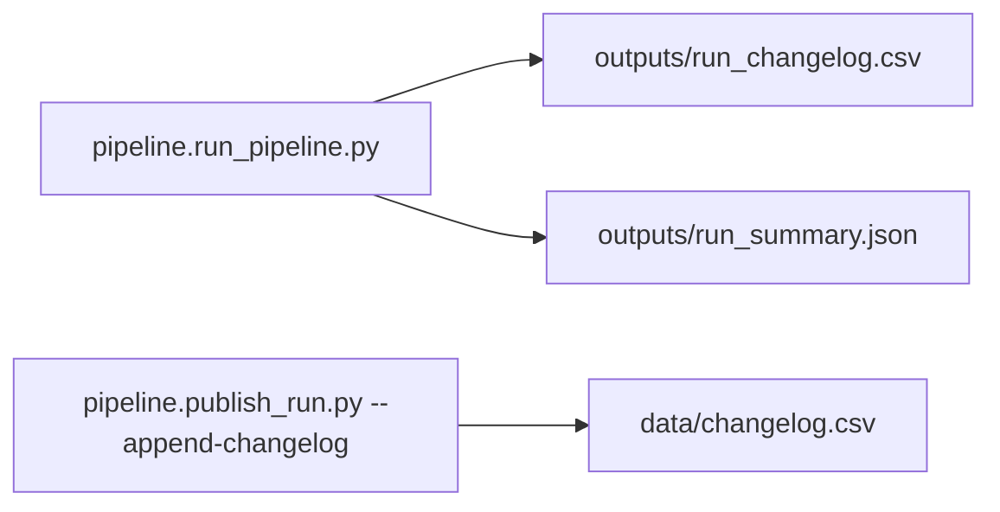

# Directory Field Changelog Tracking

## Overview

The pipeline now tracks changes to the `listed_in_nyc_gov_agency_directory` field and integrates with the project's append-only changelog system. This ensures complete audit trails for all changes to agency directory visibility.

## Background

The `listed_in_nyc_gov_agency_directory` field is computed during the export process using business logic defined in `add_nycgov_directory_column()`. This field determines which organizations appear in the public-facing NYC.gov Agency Directory.

**Key challenges:**
- The field is computed dynamically during export, not set manually
- Logic includes complex conditions (operational status, organization type, URL patterns)
- Manual overrides exist for specific records
- Changes need to be tracked for audit compliance

## Implementation

### 1. Modified Functions

#### `add_nycgov_directory_column(df, df_before_snake_case=None, df_previous_export=None, run_id=None)`

**Purpose:** Applies directory inclusion logic and tracks changes.

**Parameters:**
- `df`: Current dataframe (after snake_case conversion)
- `df_before_snake_case`: Original dataframe (deprecated - kept for backward compatibility)
- `df_previous_export`: Previous version's export file for accurate changelog comparison
- `run_id`: Run identifier for changelog tracking (optional)

**Returns:**
- If `run_id` provided: `(processed_df, list_of_changes)`
- Otherwise: `processed_df`

**Change Detection:**
```python
# Captures old values from previous export file (e.g., NYCGovernanceOrganizations_v0_18.csv)
# Computes new values using business logic
# Compares normalized boolean representations
# Returns list of change records ONLY for actual changes (not all records)
```

**Change Record Structure:**
```python
{
    'record_id': 'NYC_GOID_000123',
    'field': 'listed_in_nyc_gov_agency_directory',
    'old_value': 'False',
    'new_value': 'True',
    'reason': 'directory_logic_v1',
    'source_ref': 'export_dataset.py::add_nycgov_directory_column',
    'notes': 'Automatic logic application'  # or 'Manual override: forced to TRUE'
}
```

#### `write_run_changelog(run_dir, changes, run_id, operator)`

**Purpose:** Writes change records to `outputs/run_changelog.csv` in the run directory.

**Output Schema:**
```
timestamp_utc,run_id,record_id,record_name,field,old_value,new_value,reason,evidence_url,source_ref,operator,notes
```

### 2. CLI Parameters Added to `export_dataset.py`

| Parameter | Required | Description |
|-----------|----------|-------------|
| `--run-dir` | No | Path to run directory for changelog tracking |
| `--run-id` | No | Run identifier (e.g., timestamp-hash) |
| `--operator` | No | Operator name for changelog attribution |
| `--previous-export` | No | Path to previous export file for accurate change comparison (e.g., `NYCGovernanceOrganizations_v0_18.csv`). **Required for accurate changelog** - without it, all records will be treated as new. |

### 3. Workflow Integration



## Usage

### Basic Export (No Tracking)

```bash
python scripts/process/export_dataset.py \
  --input_csv data/input/processed.csv \
  --output_golden data/published/NYCGO_golden_v0_19.csv \
  --output_published data/published/NYCGovernanceOrganizations_v0_19.csv
```

### Export with Changelog Tracking
The orchestration CLI wraps this functionality; use `scripts/pipeline/run_pipeline.py` (see README) and review `outputs/run_changelog.csv`.

### Example Script

See `examples/export_with_changelog_tracking.sh` for a complete interactive workflow.

## Business Logic Versioning

The `reason` field includes a version identifier (`directory_logic_v1`) to track which version of the logic produced the change. When the business logic changes:

1. Update the version in the code (e.g., `directory_logic_v2`)
2. Document the logic change in this file
3. All subsequent changes will reference the new version

### Version History

#### `directory_logic_v2` (Current)

**Blanket Gatekeeper Rules (ALL must be true):**
- `operational_status` IS "Active"
- `url` does NOT contain state "ny.gov" domain (but city "nyc.gov" is OK)
- At least ONE of: `url`, `principal_officer_full_name`, or `principal_officer_contact_url` is non-empty

**Organization Type Specific Rules:**

After passing blanket rules, inclusion is determined by `organization_type`:

| Organization Type | Inclusion Rule |
|------------------|----------------|
| **Mayoral Agency** | All included |
| **Mayoral Office** | All included |
| **Division** | Only if in Org Chart |
| **Elected Office** | All included |
| **Nonprofit Organization** | Only if in Org Chart OR in exemption list |
| **Pension Fund** | All included |
| **State Government Agency** | All included |
| **Public Benefit or Development Organization** | Only if in Org Chart |
| **Advisory or Regulatory Organization** | If in Org Chart OR has main nyc.gov/index.page URL OR in exemption list |

**Nonprofit Organization Exemptions:**
- Brooklyn Public Library
- New York City Tourism + Conventions
- New York Public Library
- Queens Public Library
- Gracie Mansion Conservancy
- Mayor's Fund to Advance New York City

**Advisory or Regulatory Organization Exemptions:**
- Board of Elections
- Campaign Finance Board
- Rent Guidelines Board

**Manual Overrides:**
- Manual override lists can still force TRUE or FALSE for specific record IDs
- Currently empty (all logic is type-based)

---

#### `directory_logic_v1` (Deprecated)

**Inclusion Criteria:**

**Part A (ALL must be true):**
- `operational_status` IS "Active"
- `organization_type` IS NOT "Nonprofit Organization"
- `url` does NOT contain "ny.gov" (or URL is empty)

**AND**

**Part B (at least ONE must be true):**
- `url` is non-empty
- `principal_officer_full_name` is non-empty
- `principal_officer_contact_url` is non-empty

**OR**

**Part C (Manual Override):**
- `record_id` is in `manual_override_true_record_ids` list

**Manual Override Lists (v1):**

*True overrides:*
- NYC_GOID_000038, NYC_GOID_000149, NYC_GOID_000310, NYC_GOID_000335, NYC_GOID_000402

*False overrides:*
- NYC_GOID_000120, NYC_GOID_000121, NYC_GOID_000122, NYC_GOID_000232

## Testing

### Unit Tests

See `tests/test_export_directory_changelog.py`:
- `test_directory_column_change_tracking()` - Verifies change detection
- `test_write_proposed_changes()` - Verifies CSV output format
- `test_no_changes_when_values_unchanged()` - Verifies idempotence

### Run Tests

```bash
# All tests
make test

# Specific test
python -m pytest tests/test_export_directory_changelog.py -v
```

## Event ID Computation

Changes are deduplicated using event IDs computed as:

```python
sha256(
    lower(nfc(trim(record_id))) + '|' +
    lower(nfc(trim(field))) + '|' +
    lower(nfc(trim(old_value))) + '|' +
    lower(nfc(trim(new_value)))
)
```

This ensures the same logical change is not appended multiple times to `data/changelog.csv`.

## Edge Cases Handled

1. **First run (no old values):** `old_value` = `""`, treated as change from blank to new value
2. **Field doesn't exist in input:** Treated same as first run
3. **Boolean normalization:** All variations (`True`/`true`/`1`/`yes` → `"True"`, etc.)
4. **Manual overrides:** Noted in the `notes` field for audit clarity
5. **PascalCase vs snake_case:** Handles column name variations across processing stages

## Changelog Schema

- Per-run (ignored by git):
  - `data/audit/runs/<run_id>/outputs/run_changelog.csv`
  - `data/audit/runs/<run_id>/outputs/run_summary.json`
- Tracked (committed): `data/changelog.csv`

`data/changelog.csv` maintains the schema:
```
event_id,timestamp_utc,run_id,record_id,record_name,field,old_value,new_value,reason,evidence_url,source_ref,operator,notes
```

## Future Enhancements

1. **Derived triggers:** Automatically emit related changelog entries for impacted fields
2. **Logic comparison:** Tool to diff directory logic versions
3. **Rollback support:** Generate reversal edits from changelog
4. **Notification:** Alert on high-volume changes

## Troubleshooting

### No changes detected when expected

Check that:
- Input CSV contains the field (in PascalCase or snake_case)
- Old and new values are actually different after normalization
- `--run-dir` and `--run-id` parameters are provided

### Changes not appearing in data/changelog.csv

Verify:
- `scripts/pipeline/publish_run.py --append-changelog` completed without errors
- Event IDs are unique (not already in changelog)

### Debugging

Enable detailed logging:
```bash
python scripts/process/export_dataset.py ... 2>&1 | tee export_debug.log
```

Inspect intermediate files:
```bash
# View run changelog
csvlook data/audit/runs/<run_id>/outputs/run_changelog.csv

# Check run summary
jq . data/audit/runs/<run_id>/outputs/run_summary.json
```

## References

- [CHANGELOG_SPEC.md](CHANGELOG_SPEC.md) - Append-only changelog specification
- [README.md](../README.md) - Full workflow documentation
- [SCRIPTS.md](../SCRIPTS.md) - Script index and usage
