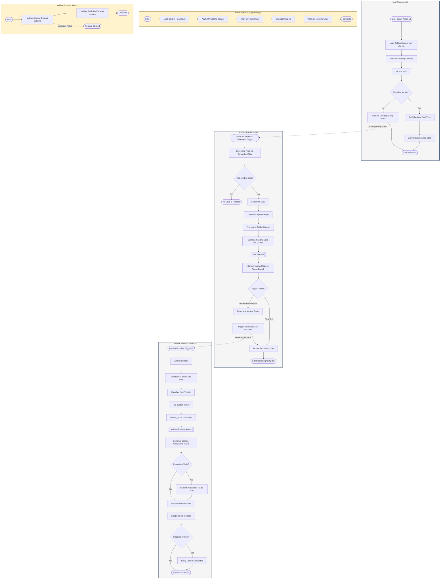
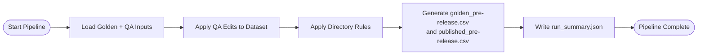
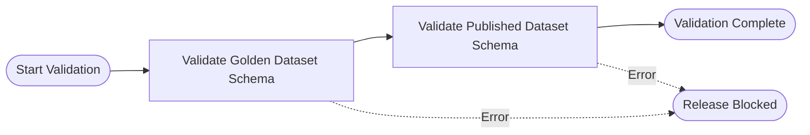

# NYCGO Edit-Publish Pipeline

> **Interactive BPMN Viewer**: [View full diagram with zoom/pan controls](https://moda-nyc.github.io/nyc-governance-organizations/docs/nycgo-edit-publish-pipeline-standalone.html)
>
> **Source files**: [BPMN XML](./nycgo-edit-publish-pipeline.bpmn) (importable to Camunda, Bizagi, etc.)

## Pipeline Subprocess Detail

## Validation Subprocess Detail

## Legend

| Symbol | Meaning |
|--------|---------|
| `([text])` | Start/End event |
| `[text]` | Task |
| `{text}` | Gateway (decision) |
| `[[text]]` | Subprocess (collapsed) |
| `-.->` | Message flow (cross-pool) |
| `-->` | Sequence flow |
